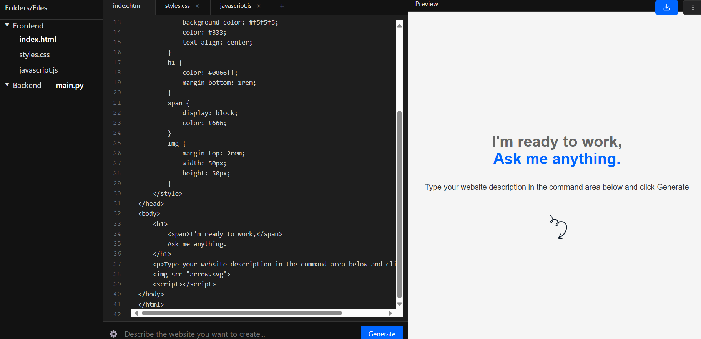
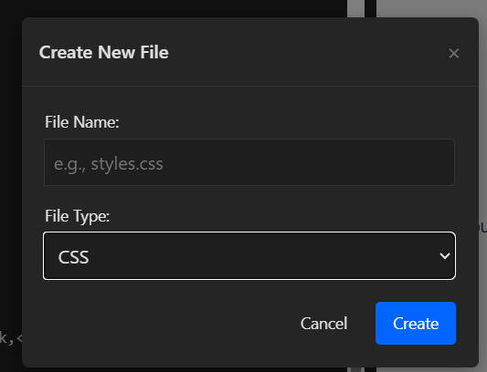
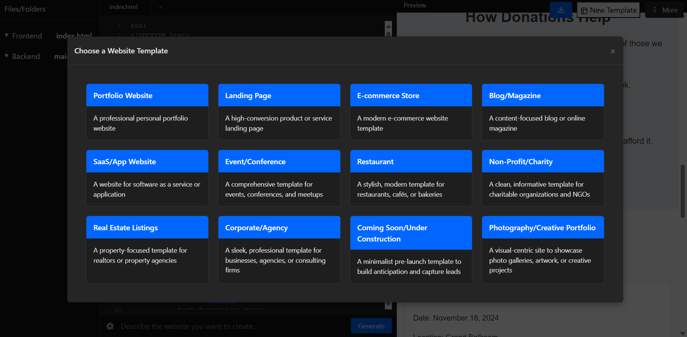
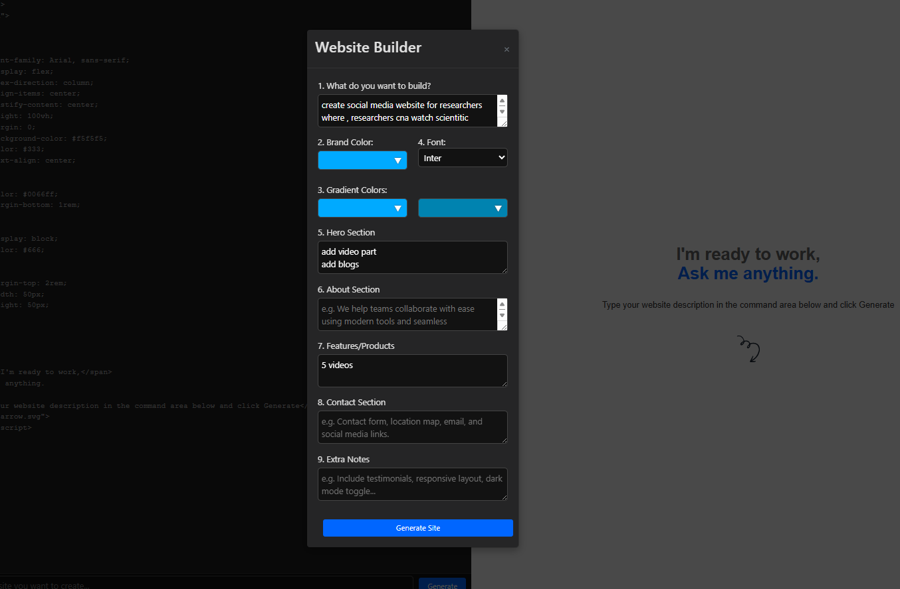

# 🤖 AI-Web-App-Builder 

Generate web code instantly using AI-powered natural language prompts!

## 🖼️ Product Screenshots

<!-- Replace these with actual paths to your screenshots -->

### Main Interface

*The central workspace showing code editor, preview, and AI command input*

### Code Generation in Action

*Demonstrating create new files

# Templates and Design

select and modify templates
 # Design from Screch 

rather then selecting template user select options to build 
## ✨ Current Features

🚀 AI-powered code generation
📝 Supports HTML, CSS, JavaScript
🖥️ Real-time web code preview
🌐 Intuitive web-based editor
⚡ Python FastAPI backend integration

## 🔮 Planned Features & Roadmap


### 🧩 Code Generation Enhancements
- [ ] Multiple Language Model Support
  - [x] Google Gemini
  - [ ] OpenAI GPT
  - [ ] Anthropic Claude
  - [ ] Local LLM Integration

### 🖌️ Template & Preset Management
- [ ] Pre-built website templates
  - Landing pages
  - Admin dashboards
  - Portfolio sites
  - E-commerce layouts
- [x] Custom template creation and saving
- [x] One-click template customization

### 🌐 Backend Flexibility
- [ ] Multi-language Backend Support
  - [x] Python (FastAPI)
  - [ ] Node.js (Express)
  - [ ] Rust (Rocket)
  - [ ] Go (Gin)
  - [ ] Java (Spring Boot)

### 🛠️ Advanced Development Tools
- [ ] Integrated terminal
- [ ] Code snippet library
- [x] AI-powered code completion
- [ ] Real-time collaboration features
- [ ] Export/Import project configurations

### 🔧 Customization Options
- [ ] Configurable AI parameters
- [ ] Custom prompt engineering
- [ ] Theme and UI customization
- [ ] Keyboard shortcut configuration

## 🛠️ Tech Stack

**Current:**
- Frontend: Vanilla JavaScript, HTML5, CSS3
- Backend: FastAPI, Google Gemini AI
- Language: Python

**Future Targets:**
- Multiple frontend frameworks
- Microservice architecture
- Containerization (Docker, Kubernetes)

## 🚀 Quick Start

### Prerequisites
- Python 3.9+
- Google Gemini API Key

### Backend Setup
```bash
# Navigate to backend directory
cd Backend

# Create virtual environment
python -m venv venv
source venv/bin/activate

# Install dependencies
pip install -r requirements.txt

# Create .env file
# Add your GEMINI_API_KEY

# Run server
uvicorn main:app --reload --port 5000
```

### Frontend
- Open `index.html` in a browser
- Ensure backend is running

## 🤝 Contributing

Interested in contributing? We welcome contributions across various domains:

1. **Feature Development**
   - Implement new language model integrations
   - Develop backend support for additional languages
   - Create UI/UX improvements

2. **Bug Fixes**
   - Identify and resolve issues
   - Improve code generation accuracy
   - Enhance performance

3. **Documentation**
   - Improve README and inline documentation
   - Create user guides
   - Write technical documentation

**Contribution Steps:**
1. Fork the repository
2. Create a feature branch
3. Commit changes
4. Push to the branch
5. Open a Pull Request

## 🌟 Vision & Philosophy

Our goal is to create a flexible, extensible AI-powered development tool that:
- Democratizes web development
- Reduces boilerplate coding
- Provides an intuitive, intelligent coding assistant
- Supports developers of all skill levels

## 📊 Project Status

- **Current Version:** 0.1.0 (Prototype)
- **Active Development:** Ongoing
- **Stability:** Experimental

## 📄 License

MIT License - Open and free for all uses

## 🌐 Community & Support

- 📢 Issues: [GitHub Issues](link-to-issues)
- 💬 Discussions: [GitHub Discussions](link-to-discussions)
- 📧 Contact: musawar.soomro25@gmail.com

---

**Disclaimer**: An AI-assisted code generation tool designed to augment, not replace, human creativity and expertise.

**Star ⭐ the repo if you find it interesting!**